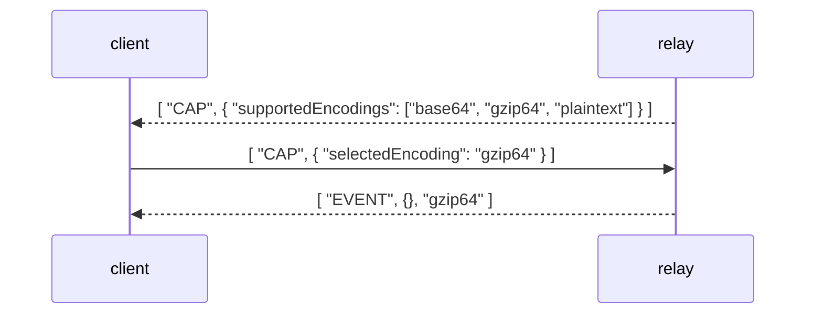

NIP-79
======

`window.nostr` offline message signature & verificiation
--------------------------------------------------------

`draft` `optional` `author:b35363`

### Abstract

This NIP proposes a modification to the WebSocket protocol to introduce a more flexible and modular approach for message compression and encoding. 
It suggests extending the current WebSocket message structure to include optional encoding information, such as _base64_, _base58_, 
_gzip64_, _gzip58_, and _plaintext_. This enhancement aims to improve modularity, retro-compatibility, and the potential for futureencoding schemes.

### Motivation
**WebSocket** is a widely used protocol for real-time communication between clients and servers. 
While the WebSocket protocol itself ([ref. LZ77](#markdown-header-lz77)) supports message compression, 
there are scenarios where direct WebSocket compression might not be sufficient or optimal. 
This NIP suggests leveraging encoding and compression techniques within the message payload to provide enhanced flexibility
and compatibility.

### Nostr Implementation Possibility

#### Extended Message Structure

The current WebSocket message structure is defined like this : `[MessageType, Payload]`
example:
```json
  ["EVENT", <json_event_structure> ]
```

This NIP suggests extending the message structure to: `[MessageType, Payload, EncodingInfo]`
example:
```json
   ["EVENT", <encoded_event_structure>, <encoding_info> ]
```

- **MessageType**: Represents the type of message, e.g., "EVENT".
- **EncodingInfo**: An **optional** field indicating the encoding used for the payload.
- **Payload**: The actual payload data of the message.


> Note that when not provided, the default encoding is set to default, for backward compatibility.

#### Supported Encodings

This NIP proposes the inclusion of the following encoding identifiers:

- `base64`: Base64 encoding.
- `base58`: Base58 encoding.
- `gzip64`: Gzip compression followed by Base64 encoding.
- `gzip58`: Gzip compression followed by Base58 encoding.
- `plaintext`: Default, uncompressed JSON payload.

#### Capability Exchange Message

In order to know what encoding is both supported by the client and server,
we need capability informations to be synced between both actors.

Here, a new message typed `CAP` is introduced to facilitate the exchange of encoding capabilities between the server and client. The structure of the "CAP" message is as follows:

```json
[ "CAP", <json_structure_encoding_caps> ]
```

Where **Capabilities** is a JSON structure containing information about supported encodings and any related configuration options.

### Benefits
#### Modularity and Retro-Compatibility

By encoding the message payload within the message itself rather than relying solely on **WebSocket**-level compression, 
the system gains modularity. This approach also maintains retro-compatibility with existing WebSocket implementations 
that might not support the latest compression extensions.

#### Future Encoding Support
The proposed message structure opens the door for supporting additional encoding schemes beyond the initial set.
Encodings like protocol buffers (**protobuff**) and **Cap'n Proto** can be added in the future without altering the core WebSocket 
protocol.

#### Flexibility and Selective Encoding
Clients and servers can now choose the most appropriate encoding for their use case. For instance, 
`gzip64` might be chosen when bandwidth optimization is crucial, while `plaintext` could be selected for minimal 
processing overhead.


### Example Usage



### Conclusion

This NIP suggests a valuable enhancement to the WebSocket protocol by introducing an extended message structure that supports various encoding options directly within the message payload. 
This approach offers improved modularity, retro-compatibility, and the potential for accommodating future encoding schemes. 
By allowing clients and servers to selectively choose their preferred encoding, the proposed changes empower developers to optimize communication based on their specific requirements.

### References

#### LZ77
https://www.igvita.com/2013/11/27/configuring-and-optimizing-websocket-compression/
https://datatracker.ietf.org/doc/html/rfc7692
https://en.wikipedia.org/wiki/LZ77_and_LZ78

#### gzip64
https://base64.guru/developers/data-uri/gzip
