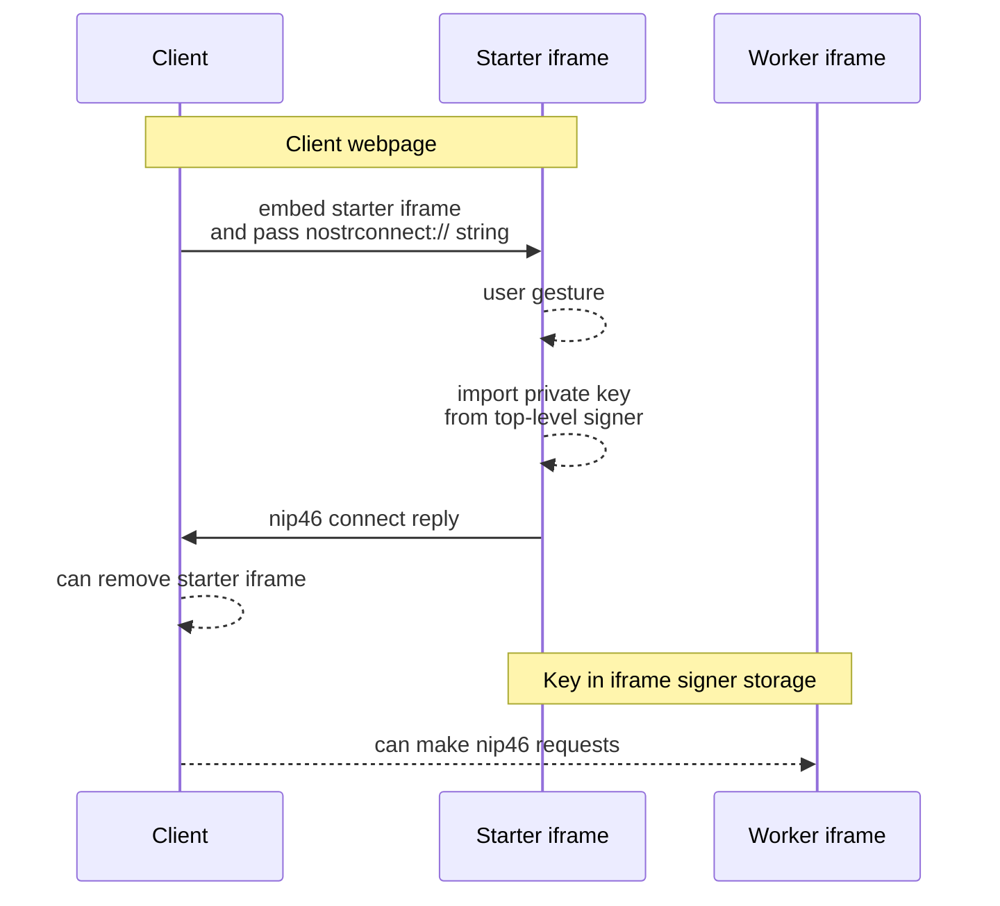
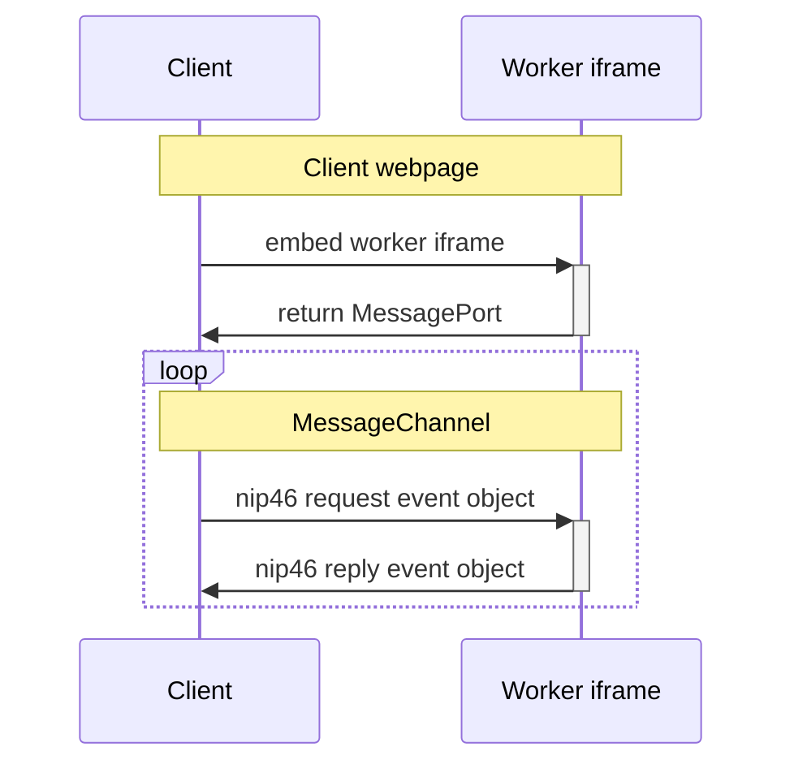
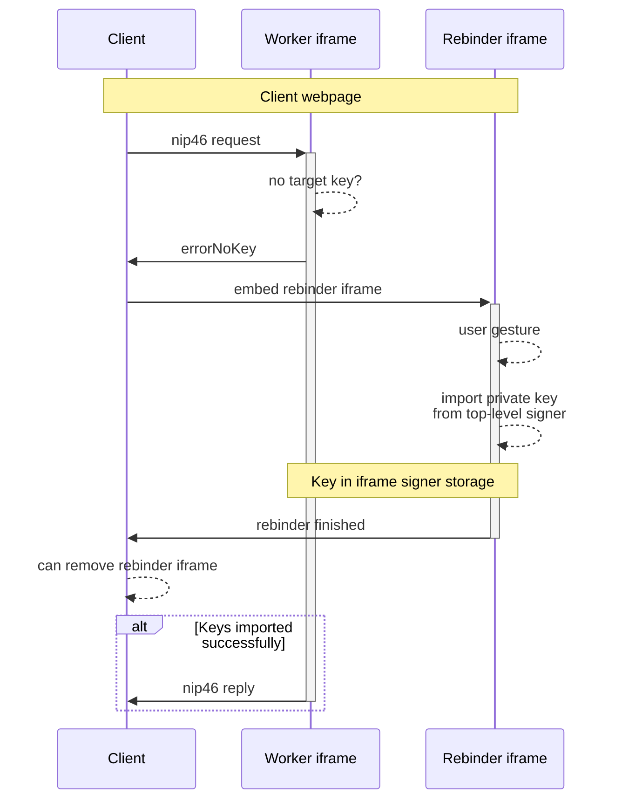
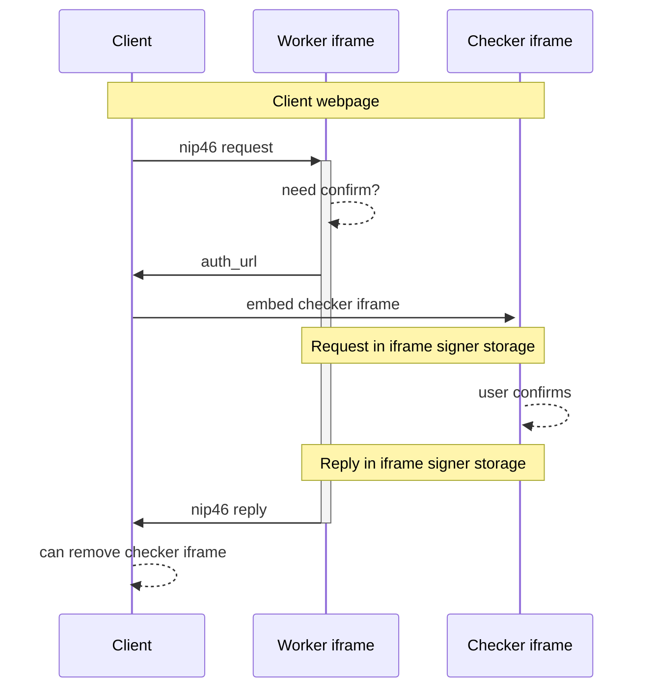

NIP-146
=======

INC: iframe-based Nostr Connect
-------------------------------

`draft` `optional`

This NIP defines a way for web apps to communicate with web signers embedded as iframes using browser APIs. It is applicable to self-custodial signers that store keys in the browser's local storage. Basically, client app does nip-46 RPC with an iframe using a [`MessageChannel`](https://developer.mozilla.org/en-US/docs/Web/API/MessageChannel).

Due to privacy-related restrictions, local storage of iframes is [partitioned](https://developer.mozilla.org/en-US/docs/Web/Privacy/State_Partitioning) from top-frame's storage - iframe of signer.com can't see the storage of top-level signer.com and can't access user's private key. Solution to this challenge is the biggest part of this NIP.

Advantage: minimal latency, no relay involved, no reliance on unreliable webpush, fully cross-platform. User private key is as safe in iframe's local storage as in top-level storage due to browsers' cross-origin restrictions.

Disadvantage: potentially more frequent "confirmations", bigger surface for web-based hacks.

## Terms

- `client`: a web app trying to access user's keys
- `signer`: non-custodial signer storing keys in it's local storage in the browser
- `top-level signer`: signer opened in a separate tab/popup
- `iframe signer`: signer opened as an iframe inside the client
- `worker iframe`: iframe signer that handles nip46 calls from the client
- `starter iframe`: iframe signer that launches the connection flow to get user confirmation and import keys from top-level signer to iframe signer
- `rebinder iframe`: iframe signer that launches re-connection flow to check that client has access to keys at the top-level signer and to re-import the keys to iframe signer
- `checked iframe`: iframe signer that displays the nip46 `auth_url` returned by the signer

## Overview

Signer MAY signal support for this NIP by adding `nip46.iframe_url` field in their `/.well-known/nostr.json?name=_` file or their nip89 `kind:31990` event. 

To initiate a connection, `client` shows the `starter iframe`. After a [`user gesture`](https://developer.mozilla.org/en-US/docs/Web/API/UserActivation), `starter iframe` interacts with `top-level signer`, acquires user confirmation and imports the private key to `iframe signer` storage.

When connection is established and private key is imported to `iframe signer` storage, `client` embeds invisible `worker iframe` and exchanges nip46 messages with it using a `MessageChannel`.

If `worker iframe` receives a request but has no target keys due to _ephemeral_ partitioned storage ([Brave](https://brave.com/privacy-updates/7-ephemeral-storage/), Webkit), it pauses the call and sends an error code to the `client`, which then shows the `rebinder iframe`. After a `user gesture`, `rebinder iframe` interacts with `top-level signer` and if `client` is already approved - imports the private key to `iframe signer` storage. At this point `worker iframe` can retry the paused call and send the reply back to `client`.

If `client` request must be confirmed by the user, `worker iframe` sends `auth_url` nip46 response, which is presented to the user as a visible `checker iframe`, instead of a popup as in nip46. This way `checker iframe` can access the request info stored by the `worker iframe`. After user confirms, `worker iframe` sends reply to `client`.

This NIP covers interactions between `client` and `iframe signers`. Interactions of `signer` frames (top-level/iframes) are up to implementations (see Appendix for recommendations).

## Starter iframe

To initiate a connection, a `starter iframe` MAY be embedded by the `client`. 

`starter iframe` MUST be served when `iframe_url` has `?connect=` parameter set to `nostrconnect://` string defined in nip46. 

`starter iframe` SHOULD display a button suggesting the users to `Continue`, recommended dimentions are up to `180px` width and `80px` height.

If user clicks `Continue`, `starter iframe` SHOULD create a `top-level signer` popup and interact with it to acquire the private key if user confirms, details are up to implementations. 

When `starter iframe` has finished importing the user private key, it MUST notify the `client` using [`postMessage`](https://developer.mozilla.org/en-US/docs/Web/API/Window/postMessage). 

The message `data` will be an `Array` with a `starterDone` string and a nip46 `connect`-method reply object (created with a `secret` value from `nostrconnect://` string):

```
// starter iframe
const replyObject = await createConnectReply(nostrconnect_secret);
window.parent.postMessage(["starterDone", replyObject], "*");
```

To receive messages from iframes, `client` listens to `message` events.

When `client` receives a message whose `data` field is an `Array` AND has first element equal to `starterDone` AND has second element equal to valid `connect` reply object AND has message `origin` equal to `iframe_url` origin it MAY destroy the `starter iframe` and assume connection is established. 

`pubkey` from `connect` reply event is nip46 `remote signer pubkey`.

```
// client
window.addEventListener("message", (msg) => {
  if (Array.isArray(msg.data) 
    && msg.data[0] === "starterDone" 
    && isValidConnectReply(msg.data[1], nostrconnect_secret)
    && msg.origin === originOf(iframe_url)
    ) {
    const remote_signer_pubkey = msg.data[1].pubkey;
    // destroy starter iframe
    // may create worker iframe
  }
})
```

In case of error, `starter iframe` SHOULD send a message of `["starterError", "Error text"]`, so that client could notify the user.

`client` SHOULD save the `iframe_url` to local storage and reuse it until logout, to make sure the `worker iframe` is loaded from the same origin that was used when connection was established.



## Worker iframe

After connection has been established, `client` MAY create an invisible `worker iframe` served by `iframe_url`. 

When created, `worker iframe` MUST create a `MessageChannel` and pass one `port` to the client with a message `["workerReady", port]`:

```
// worker iframe
const channel = new MessageChannel();
window.parent.postMessage(["workerReady", channel.port1], "*", [channel.port1]);
```

When `client` receives a message whose `data` field is an `Array` AND has first element equal to `workerReady` AND has message `origin` equal to `iframe_url` origin it MAY use the `port` from the second `data` element to send nip46 request event objects to it, and then MUST listen to replies from the same `port`:


```
// client
window.addEventListener("message", (msg) => {
  if (Array.isArray(msg.data) 
    && msg.data[0] === "workerReady" 
    && !!msg.data[1]
    && msg.origin === originOf(iframe_url)
    ) {
    const worker_port = msg.data[1];
    // may send requests to worker_port
  }
})

// when worker_port is received
worker_port.postMessage(nip46request);
worker_port.onmessage = (msg) => {...}
```

`worker iframe` will use the second `port` of the `channel` to similarly receive nip46 requests and pass `nip46` replies. 

`MessageChannel` is used instead of `window.postMessage` to let `worker iframe` pass it's port to it's request-processing component (service worker etc) and have `client` talk directly to it without additional latency.

In case of initialization error, `worker iframe` MAY send a message of `["workerError", "Error text"]` instead of the `workerDone`, so that client could notify the user.



## Rebinder iframe

When `worker iframe` receives a nip46 request targeting user pubkey that it doesn't have (local storage deleted) it MAY pause the call and then MUST reply with a string `errorNoKey:<requestEvent.id>` to notify the `client`.

If `client` receives `errorNoKey:<requestEvent.id>` reply matching one of pending requests, it MAY display a `rebinder iframe`. 

`rebinder iframe` MUST be served when `iframe_url` has `?rebind=<client_pubkey>&pubkey=<remote_signer_pubkey>` parameters.

`rebinder iframe` SHOULD display a button suggesting the users to `Continue`, recommended dimentions are up to `180px` width and `80px` height.

If user clicks `Continue`, `rebinder iframe` SHOULD create a `top-level signer` popup and interact with it to acquire the private key if `client_pubkey` is already permitted to access the `remote_signer_pubkey`, details are up to implementations.

When `rebinder iframe` has finished importing the user private key, it MUST notify the `client` using `postMessage`. The message `data` will be `["rebinderDone"]`:

```
// rebinder iframe
window.parent.postMessage(["rebinderDone"], "*");
```

When `client` receives a message whose `data` field is an `Array` AND has first element equal to `rebinderDone` AND has message `origin` equal to `iframe_url` origin it MAY destroy the `rebinder iframe`. 

```
// client
window.addEventListener("message", (msg) => {
  if (Array.isArray(msg.data) 
    && msg.data[0] === "rebinderDone" 
    && msg.origin === originOf(iframe_url)
    ) {
    // destroy rebinder iframe
  }
})
```

In case of error, `rebinder iframe` SHOULD send a message of `["rebinderError", "Error text"]`, so that client could notify the user.

When `worker iframe` that has paused the request notices that user private key was imported by `rebinder iframe` into the local storage, it MUST restart the paused call and deliver the reply to the client.



## Checker iframe

If `client` request must be confirmed by the user, `worker iframe` MAY pause the call and then MUST reply with `auth_url` nip46 response.

`auth_url` MAY be presented by `client` to the user, and in that case MUST be shown in a visible `checker iframe` instead of a popup as in nip46 to provide access to `iframe signer` storage. Recommended dimentions are minimum `300px` width and `600px` height.

After user confirms the request in `checker iframe`, `worker iframe` MUST resume the paused call and deliver the reply to the client.

After reply is received from `worker iframe`, `client` SHOULD destroy the `checker iframe`.



## Client Pseudocode

### Starter iframe usage

```
// client

const iframeOrigin = new URL(iframeUrl).origin;

// helper
const getReply = async (label: string) => {
  return new Promise(ok => {
    const handler = (e) => {
      if (e.origin !== iframeOrigin || !Array.isArray(e.data) || e.data[0] !== label) return;
      window.removeEventListener("message", handler)
      ok(e.data?.[1]);
    }
    window.addEventListener("message", handler)
  })
};

// nip46 nostrconnect string
const secret = "<random-value>";
const nostrconnect = createNostrConnect(secret);

// display starter iframe 
const iframe = createIframe(`${iframeUrl}?connect=${nostrconnect}`, 'style="width: 180px; height: 80px')

// wait for starter to return valid connect reply or error
const remoteSignerPubkey = await new Promise((ok, err) => {
  getReply("starterDone").then(r => {
    if (isValidConnectReply(r, secret)) ok(r.pubkey)
    else err("Invalid connect reply")
  });
  getReply("starterError").then(err);
})

// can delete starter
deleteIframe(iframe);

// create worker iframe,
// use remoteSignerPubkey to send nip46 requests
...
```

### Worker iframe usage

```
// client

// create invisible iframe
const iframe = createIframe(iframeUrl, 'style="display: none"')

// wait for worker to return a port or an error
const workerPort = await new Promise((ok, err) => {
  getReply("workerDone").then(ok);
  getReply("workerError").then(err);
})

// send nip46 request event
const nip46Req = await createReq("sign_event", {...});
workerPort.postMessage(nip46req);
workerPort.onmessage = (reply) => {
  // process reply
}
...
```


### Rebinder iframe usage

```
// client

// worker iframe sends an error message
let workerReply = await getMessage(workerPort);

if (workerReply.startsWith("errorNoKey:")) {

  // display starter iframe 
  const iframe = createIframe(`${iframeUrl}?rebind=${clientPubkey}&pubkey=${remoteSignerPubkey}`, 'style="width: 180px; height: 80px')

  // wait for rebinder 
  await new Promise((ok, err) => {
    getReply("rebinderDone").then(ok);
    getReply("rebinderError").then(err);
  })

  // can delete rebinder
  deleteIframe(iframe);

  // re-fetch reply
  workerReply = await getMessage(workerPort);
}

// process worker reply
...
```

### Checker iframe usage

```
// client

// worker iframe sends 'auth_url' error
let workerReply = await getMessage(workerPort);

const authUrl = getAuthUrl(workerReply);
if (authUrl) {

  // display checker iframe 
  const iframe = createIframe(authUrl, 'style="min-width: 300px; min-height: 600px')

  // re-fetch reply
  workerReply = await getMessage(workerPort);

  // can delete checker iframe
  deleteIframe(iframe);
}

// process worker reply
...
```


## Appendix

Recommendations for `signer` implementations:

- `starter iframe` and `rebinder iframe` MAY open a `top-level signer` in a popup after user gesture (click on Continue) and MAY then send messages to it using `postMessage`.
- after user confirms in the `top-level signer` it MAY send the private key back to it's `window.opener`
- `signer` frames should check `origin` of received messages to make sure they're talking to each other
- popups SHOULD be opened using `window.open(url, "<random_target>", "<options>")`, `<random_target>` is required (instead of `_blank`) to make sure popup has access to `opener`, `noopener` SHOULD NOT be provided for the same reason.
- `iframe signers` SHOULD NOT launch a popup until their service worker has started, it seems like Safari pauses iframe's SW initialization if the tab loses focus
- `iframe signers` MAY be sandboxed, but then MUST at least have `allow-scripts,allow-same-origin,allow-popups-to-escape-sandbox`
- `starter iframe` SHOULD be provided access to `referrer` to let the signer use it as client name/url.
- `iframe signers` MAY use `MessageChannel` to create a port that will be transferred to `top-level signer` and to it's service-worker so that it could then export the user private key to the `iframe signer`.
- `signer` SHOULD use random auxiliary sub-domains to serve `iframe_url` - Chrome desktop allows users to delete signer's storage on client's tab, which (mistakenly?) removes top-level signer storage too and users' keys might be lost.
- `top-level signer` MAY export `client pubkey` to `iframe signer` along with user private key to scope the `iframe signer` to this particular connection.
