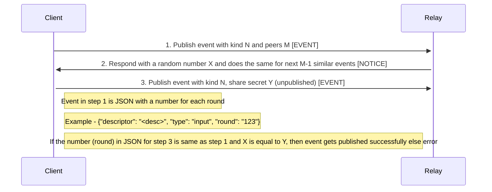

NIP-33
======

Verifiable Secret Sharing
---------------

`draft` `optional` `author:1440000bytes`

Relays may decide to allow secret sharing.

Motivation
----------

This NIP allows relays to share a random secret with some clients that are trying to coordinate a coinjoin round. Coinjoin is the primary usecase, however it can be used for other things as well that require coordination between peers.

Gregory Maxwell had mentioned chaumian blind signatures in a bitcointalk post in 2013: https://bitcointalk.org/index.php?topic=279249

> Using chaum blind signatures: The users connect and provide inputs (and change addresses) and a cryptographically-blinded version of the address they want their private coins to go to; the server signs the tokens and returns them. The users anonymously reconnect, unblind their output addresses, and return them to the server. The server can see that all the outputs were signed by it and so all the outputs had to come from valid participants. Later people reconnect and sign.

This NIP is an alternative to blind signatures and introduces a simple mechanism to verify if the users registering outputs are the ones that registered inputs.

Sequence Diagram
----------



Client Behavior
---------------

Clients SHOULD use the `supported_nips` field to learn if a relay supports this NIP.  Clients SHOULD NOT send events with secret sharing requests or secrets to relays that do not support this NIP.

Relay Behavior
---------------

Relays should verify if secret shared in step 3 above and the number for each round added in JSON event.


Python Example
--------------

Client:

```python

import socket


def client():
    host = socket.gethostname()
    port = 5000

    client_socket = socket.socket()
    client_socket.connect((host, port))

    message = '{"event":"JSON with round as 123", "kind":"111", "peers":"5"}'

    client_socket.send(message.encode())
    data = client_socket.recv(1024).decode()

    print('Received from relay: ' + data)

    message = input(" -> ")

    client_socket.send(message.encode())
    data = client_socket.recv(1024).decode()

    print('Received from relay: ' + data)

    client_socket.close()

if __name__ == '__main__':
    client()
```

Server:

```python

import socket
import random


def server():

    host = socket.gethostname()
    port = 5000

    server_socket = socket.socket()
    server_socket.bind((host, port))

    server_socket.listen(2)
    conn, address = server_socket.accept()

    secret = random.random()

    print("Connection from: " + str(address))
    while True:

        data = conn.recv(1024).decode()
        if not data:
            break
        print("from connected client: " + str(data))

        if 'peers' in str(data).lower().strip():
            message = secret
        elif str(secret) in str(data).lower().strip():
            message = "SUCCESS"

        conn.send(str(message).encode())

    conn.close()


if __name__ == '__main__':
    server()
```

Suggested Use Cases
-------------------

* [Coinjoin](https://github.com/1440000bytes/joinstr)
* Bitcoin Contracts using DLC or covenants in future