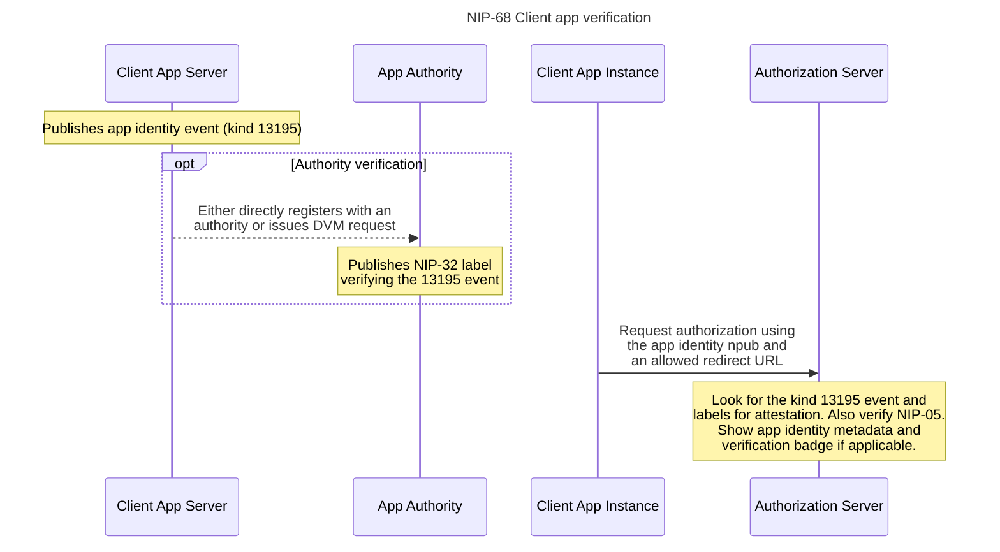

NIP-68
======

Client App Registration via Nostr for Delegated Auth Flows
--------------------

`draft` `optional`



## Motivation

This NIP describes a way for client applications (as described by protocols like OAuth) to dynamically register themselves and specify restrictions and protections for delegated auth flows like OAuth and NWC. This is useful for protecting users from phishing attacks and providing them with more information about the client app.

One of the biggest advantages of using a decentralized protocol like Nostr for delegated auth is that apps are always identified by keypairs and there is an open network for attestation and reputation of those keypairs. For example, traditionally with OAuth, client applications need to register with the authentication server ahead of time to get a client ID and client secret, limit redirect urls, prove domain ownership, etc. For decentralized protocols like NWC (NIP-47), this would imply registering with every possible wallet provider to prove your app's identity. This isn't feasible in practice.

Financial applications have a similar issue with Open Finance and access to user bank accounts through services like Plaid. The way that Plaid gets around this client app registration problem, for example, is by acting as a trusted authority for financial institutions which can attest to the trustworthiness of client applications. With Nostr, this whole process can be decentralized and opened up to trusted authorities that can attest to the identity of a client application. Longer term, the reputation of an npub via web-of-trust, etc. could be used to provide this attestation rather than any single authority.

## Terms

* **Resource Owner**: The entity that can grant access to a protected resource, typically an end-user.
* **Client App**: An application that makes requests on behalf of the resource owner to access protected resources. It can be a web app, mobile app, or any other type of application.
* **Authorization Server (AS)**: The server that authenticates the resource owner and issues access tokens to the client. This is a Nostr app that typically runs on an always-on computer (eg. in the cloud or on a Raspberry Pi). This server checks the client app's registration to help protect against phishing and provide the user with more information about the client app.

## Client App Registration

Each client app has an “identity” keypair whose private key stays server side. For example, if Zappy Bird was a client application that wanted to identify itself and be verified, it would have one unique nostr keypair that identifies “Zappy Bird”. Using this keypair, it would publish a new kind 13195 nostr event which represents a Client App Registration:

```jsonc
{
  "kind": 13195,
  // ... other fields
  "content": {
    "name": "Zappy Bird",
    "domain": "zappybird.com",
    "picture": "https://zappybird.com/logo.png",
    "image": ["https://zappybird.com/auth/callback"],
    "allowed_redirect_uris": ["https://zappybird.com/auth/callback", "zappybird://auth/callback"],
  }
}
```

This event contains the content that would show up on a permissions page: app name, image, and a NIP-05-verified domain. See [below](#why-not-just-use-the-kind-0-metadata-event-for-app-identity) for reasons why this shouldn’t just be the kind-0 event. Critically, it can also contain restrictions on who can receive connections as this app identity.

### OAuth

For an Oauth-style flow, the kind 13195 event should include allowed redirect URLs. This way, auth servers can choose to only redirect to a valid URL pattern owned by the client application. This is a known best practice in OAuth, specifically for public applications (SPAs or mobile apps). It prevents a public app from claiming to be some reputable client app because they can’t get the authorization code in the redirect from the AS.

## Authority Verification

As a first level of verification, the AS should check the listed domain for NIP-05 verification. This at least ensures that the app owns the domain they claim to be. However, there’s also the opportunity for an additional authority to vet client apps more deeply to provide an added level of assurance to auth servers and resource owners.

Once the client app has published this event, it can be optionally verified by an authority via a [NIP-32](/32.md) label event.

```jsonc
{
  "kind": 1985,
  // ... other fields
  "tags": [
    ["L", "nip68.client_app"],
    ["l", "verified", "nip68.client_app"],
    ["e", "<event_id>", "<relay_url>"],
  ],
}
```

For example, if a company like Plaid is a known trusted verifier of financial client applications, wallets could look for a label event from Plaid for the given 13195 event and show the user an extra “verified” badge. In order to be verified by a trusted authority, the client application can manually register with one or more known authorities. As a future optimization, they can issue a [NIP-89 Data Vending Machine](/89.md) request to optionally pay anyone claiming to be an authority to issue labels verifying their app identity event. This can be automatic, asynchronous, and fully decentralized.

Longer term, it’s possible that the need for additional authority verification goes away with other, better forms of nostr reputation scores and trust from those in the AS or user's network.

### Revocation

To revoke verification, the authority can publish a new label event with the same event ID and a different label. This will remove the “verified” badge from the client app. For example:

```jsonc
{
  "kind": 1985,
  // ... other fields
  "tags": [
    ["L", "nip68.client_app"],
    ["l", "revoked", "nip68.client_app"],
    ["e", "<event_id>", "<relay_url>"],
  ],
}
```

Authorization servers can subscribe to these label events to keep their client app database up to date or even automatically revoke conncections to client apps that have been unverified.

## OAuth flow example for NWC

A practical example of this flow can be illustrated with where a client app establishes a [NIP-47](/47.md) connection to a wallet via an OAuth flow. In this flow, the wallet is the AS and the client app is the client (an app trying to take some actions with the user's wallet). The wallet might be a custodial provider which has an OAuth flow via a web interface. Assume that the user has an account with this wallet provider and a LUD-16 address of <pleb@wallet.net>. Note that this just describes an example implementation which could use this NIP, but it is not a proposed standard itself.

1. The client app *server* publishes a kind 13195 event with its identity and allowed redirect URLs.
2. A user types their lightning address (<pleb@wallet.net>) into the client app and clicks "Connect Wallet".
3. The client app starts an OAuth flow to a pre-agreed-upon URL at the wallet provider. Eg. `https://wallet.net/oauth/authorize?client_id=<client_id>&redirect_uri=<redirect_uri>&response_type=code`. The client ID is in the format `<client app identity npub>:<relay where the 13195 event was published>`. For example, `npub16f80k0f4vg0nnlepxrqxeh81slyzst2d:wss://myrelay.info`.
4. The Authorization Server (wallet) checks the client ID and looks up the 13195 event at the specified URL. It checks the domain and redirect URLs and shows the user the client app's name and image. Auth should only proceed if the redirect URL is included in the event's `allowed_redirect_urls`. If the NIP-05 domain is verified, the wallet can show a "verified" badge next to the domain.
5. The wallet also then looks for any label events from known authorities for this 13195 event. If it finds one, it shows a "verified" badge next to the client app's name. It can also show the user the authority's name and a link to their website.
6. The user approves the connection and the wallet issues an auth code to the client app's redirect URL.
7. The client app's server receives the auth code and exchanges it for an access token (and NWC connection details) with the wallet's token endpoint.

This flow allows all NWC wallets to have a consistent way to verify client apps and protect users from phishing attacks. It also allows for a decentralized way for client apps to register will all wallets supporting this protocol, rather than needing to register one-by-one with each wallet.

## Appendix

### Why not just use the kind 0 metadata event for app identity?

It’s a good question! Most of the metadata in these two events overlaps - display name, nip05, picture, etc. We could just add the redirect restrictions to the metadata event content instead of adding a new event kind. However, the main motivation for using a new event is so that authority label events won’t get invalidated if the client app changes unrelated metadata in their kind 0 event. The label should only apply to fields that are important for trust and phishing-prevention. If we used the metadata event, and the app wanted to change its “about” string, any existing labels to the metadata event would be invalidated because the event ID would change.
