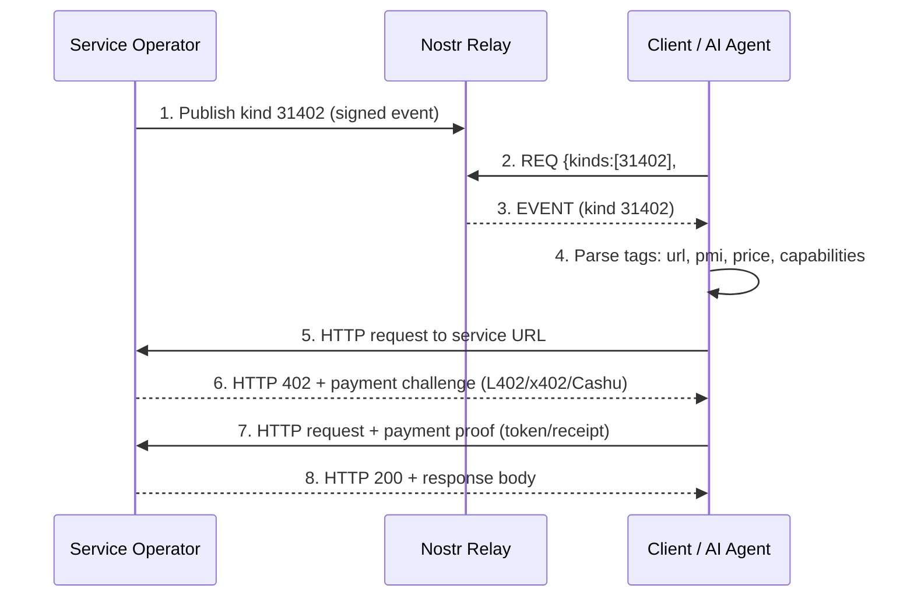

NIP-XX
======

Paid API Service Announcements
-------------------------------

`draft` `optional`

This NIP defines one addressable event kind for announcing paid API services on Nostr. It enables decentralised discovery of HTTP APIs gated by any payment mechanism (L402, x402, Cashu, or others), without reliance on a central registry.

## Motivation

Paid HTTP APIs already work. Middleware like L402 and x402 gates any endpoint behind Lightning, Cashu, or stablecoin payments using standard HTTP 402 challenge-response (RFC 9110 section 15.5.3). The payment flow requires no Nostr involvement: a client hits an endpoint, gets a 402, pays, retries with proof, and receives the response. This works today with zero relay dependency.

What is missing is **discovery**. How does a client find paid APIs without a centralised directory? Operators currently list services on proprietary platforms or rely on word-of-mouth.

This NIP adds a decentralised discovery layer. Service operators publish a kind 31402 event on Nostr describing what their API does, how much it costs, and which payment methods it accepts. Clients (including AI agents) subscribe to relays with standard filters and discover services automatically. Nostr handles discovery; HTTP handles payment and consumption. The two are cleanly separated.

## Relationship to Existing NIPs

- **[NIP-89](89.md) (Application Handlers):** App handlers announce Nostr-native applications that process specific event kinds. Paid service announcements declare HTTP API capabilities gated by payment. Different scope; no overlap.
- **NIP-105 (PR #780, open since September 2023):** Also proposes kind 31402 for API service listings. Not merged. This NIP was developed independently with a different tag schema; see [Kind Allocation](#kind-allocation).
- **[NIP-90](90.md) (Data Vending Machines):** DVMs are Nostr-native; jobs and results flow through relays as kind 5xxx/6xxx events. Paid services are HTTP-native; Nostr handles discovery only, consumption uses standard REST. DVMs are intent-based ("I want X done"); paid services are offer-based ("I provide X at Y price"). DVMs keep computation on-relay for composability (job chaining); paid services keep computation off-relay for efficiency and privacy. They complement each other: a DVM MAY delegate to a paid service for the actual computation, publishing the result back to the relay.
- **[NIP-57](57.md) (Zaps):** Zaps are tips and donations. Paid service announcements declare static price listings for API capabilities. No overlap.

### Why not NIP-99 (Classified Listings)?

[NIP-99](99.md) classifieds and kind 31402 paid service announcements serve different consumers with incompatible data models:

| Aspect | NIP-99 Classified Listing | Kind 31402 Paid Service |
|--------|--------------------------|------------------------|
| Consumer | Humans browsing a marketplace | Machines (AI agents, API clients) |
| Price model | Single price per listing | Per-capability pricing with multiple tiers |
| Payment negotiation | Out-of-band | Machine-readable `pmi` tags with rail-specific parameters |
| Endpoint declaration | None | `url` tags with multi-transport redundancy |
| Request/response schema | None | JSON Schema for request and response bodies |
| Content structure | Free-text description + images | Structured capability array with endpoint paths |
| Subscription pattern | `{"kinds": [30402]}` returns goods, services, rentals, jobs | `{"kinds": [31402]}` returns only machine-consumable API endpoints |

A client subscribing to [NIP-99](99.md) to find "APIs that accept Lightning" would receive furniture listings, concert tickets, and apartment rentals in the same feed. The tag schemas are incompatible: [NIP-99](99.md) uses `price` as a single amount; kind 31402 uses `price` as a per-capability tuple. [NIP-99](99.md) has no concept of endpoint URLs, payment method identifiers, or request schemas.

Adding an `api` tag to [NIP-99](99.md) would not resolve this. The content model (free-text vs structured capabilities), the price model (per-listing vs per-capability), and the intended consumer (human vs machine) are fundamentally different.

## Kind

| Kind  | Description                     |
| ----- | ------------------------------- |
| 31402 | Paid API Service Announcement   |

Kind 31402 is an addressable event ([NIP-01](01.md)). The combination of `pubkey` + `d` tag uniquely identifies a listing. Publishing again with the same values replaces the existing announcement.

---

## Event Structure

### Tags

| Tag         | Required    | Repeatable | Description                                                      |
| ----------- | ----------- | ---------- | ---------------------------------------------------------------- |
| `d`         | REQUIRED    | no         | Unique service identifier. Max 256 characters.                   |
| `name`      | REQUIRED    | no         | Human-readable service name. Max 256 characters.                 |
| `url`       | REQUIRED    | yes (1-10) | HTTP endpoint URL. Multiple tags for multi-transport redundancy. Max 2048 characters each. |
| `summary`   | RECOMMENDED | no         | Service description. Max 4096 characters.                        |
| `pmi`       | REQUIRED    | yes (1-20) | Payment Method Identifier. See [PMI Values](#canonical-pmi-values). |
| `price`     | RECOMMENDED | yes (1-100)| Capability pricing. Format below.                                |
| `s`         | OPTIONAL    | no         | Underlying API endpoint URL that this service proxies. Enables clients to discover all providers proxying the same API (e.g. all proxies for `https://api.openai.com/v1/chat/completions`). When present, the `d` tag SHOULD match the `s` tag value. Max 2048 characters. |
| `t`         | OPTIONAL    | yes (1-50) | Topic tag for discovery filtering. Max 64 characters each.       |
| `picture`   | OPTIONAL    | no         | Icon URL (`http://` or `https://`). Max 2048 characters.         |
| `alt`       | RECOMMENDED | no         | Short human-readable plaintext description of the event for clients that do not support kind 31402. |
| `expiration`| OPTIONAL    | no         | [NIP-40](40.md) expiration timestamp. Relays MAY discard the event after this time. |

**Tag formats:**

```
["d", "<service-identifier>"]
["name", "<human-readable-name>"]
["url", "<endpoint-url>"]
["summary", "<description>"]
["pmi", "<rail>", ...additional-elements]
["price", "<capability_name>", "<amount>", "<currency>"]
["s", "<upstream-api-url>"]
["t", "<topic>"]
["alt", "<human-readable-description>"]
["picture", "<icon-url>"]
["expiration", "<unix-timestamp>"]
```

**`d` tag:** Clients SHOULD use a stable, URL-safe string (e.g. `jokes-api`, `inference-v2`). The `d` tag MUST NOT be empty or whitespace-only.

**`url` tag:** Each URL becomes a separate tag. Multiple URLs represent the same service accessible via different transports (clearnet, Tor .onion, Handshake .hns). Clients SHOULD try URLs in tag order and use whichever is reachable. Schemes `data:`, `file:`, `javascript:`, `blob:`, and `vbscript:` are prohibited. URLs MUST NOT contain control characters.

**`pmi` tag:** A multi-element tag. The first element after the tag name identifies the payment rail. Additional elements carry rail-specific parameters. See [Canonical PMI Values](#canonical-pmi-values).

**`price` tag:** Amount MUST be a non-negative integer in the smallest unit of the specified currency (satoshis for `sats`, cents for `usd`, pence for `gbp`). Capability names MUST NOT exceed 64 characters. Currency codes MUST NOT exceed 32 characters.

### Content

The event content is a JSON string containing an object with optional fields:

| Field          | Type     | Description                                                    |
| -------------- | -------- | -------------------------------------------------------------- |
| `capabilities` | array    | Detailed capability descriptions (max 100 entries).            |
| `version`      | string   | Service version string (max 64 characters).                    |

Each capability object:

| Field          | Type   | Required | Description                                                  |
| -------------- | ------ | -------- | ------------------------------------------------------------ |
| `name`         | string | REQUIRED | Capability name (max 64 characters). MUST match a `price` tag capability name if pricing is declared. |
| `description`  | string | REQUIRED | Human-readable description (max 4096 characters).            |
| `endpoint`     | string | OPTIONAL | Endpoint path or full URL (e.g. `/api/joke` or `https://api.example.com/v1/chat`). Max 2048 characters. |
| `schema`       | object | OPTIONAL | JSON Schema (draft 2020-12) for the POST request body. Enables AI agents to auto-generate type-safe API calls without documentation. |
| `outputSchema` | object | OPTIONAL | JSON Schema (draft 2020-12) for the response body. Enables AI agents to auto-generate type-safe API calls without documentation. |

The content JSON MUST NOT exceed 64 KiB when serialised. Implementations SHOULD reject content with nesting depth exceeding 20 levels to prevent denial-of-service via deeply nested schemas.

If the content has no capabilities or version, it SHOULD be an empty JSON object (`{}`).

Tags are sufficient for discovery, filtering, and pricing. Content capabilities are an optimisation for programmatic consumers (AI agents, MCP clients) that need request/response schemas without fetching external documentation. Implementations that only need discovery MAY ignore content entirely.

---

## Canonical PMI Values

The `pmi` tag uses a multi-element format where the first element identifies the payment rail and subsequent elements carry rail-specific metadata.

| Rail identifier | Additional elements             | Description                                                    |
| --------------- | ------------------------------- | -------------------------------------------------------------- |
| `l402`          | `lightning`                     | L402 (formerly LSAT). Lightning BOLT-11 invoice in the `WWW-Authenticate` header. |
| `x402`          | `<network>`, `<token>`, `<receiver-address>` | x402 stablecoin payments. Network is the chain identifier (e.g. `base`). Token is the asset (e.g. `usdc`). |
| `cashu`         | _(none)_                        | Cashu ecash. Generic; mint discovery is out of scope.          |
| `xcashu`        | _(none)_                        | Cashu ecash via NUT-24 (X-Cashu HTTP header protocol).         |

**Examples:**

```
["pmi", "l402", "lightning"]
["pmi", "x402", "base", "usdc", "0xAbC123..."]
["pmi", "cashu"]
["pmi", "xcashu"]
```

Implementations MUST accept the four canonical rail identifiers listed above. Unrecognised rail identifiers SHOULD be ignored by clients that do not support them.

Future payment rails MAY be added by convention. Implementations SHOULD NOT reject events containing unrecognised `pmi` rails, as this allows forward compatibility.

---

## Examples

### AI Inference Service (Lightning + Cashu)

```json
{
  "kind": 31402,
  "pubkey": "<operator-hex-pubkey>",
  "created_at": 1711234567,
  "tags": [
    ["d", "llm-inference-v1"],
    ["name", "LLM Inference API"],
    ["alt", "Paid API: LLM Inference API via Lightning and Cashu"],
    ["url", "https://inference.example.com/v1"],
    ["url", "http://inferencexyz123.onion/v1"],
    ["summary", "GPT-4 class inference with Lightning and Cashu payment. Supports chat completions and embeddings."],
    ["pmi", "l402", "lightning"],
    ["pmi", "cashu"],
    ["price", "chat_completion", "100", "sats"],
    ["price", "embedding", "10", "sats"],
    ["t", "ai"],
    ["t", "inference"],
    ["t", "llm"]
  ],
  "content": "{\"capabilities\":[{\"name\":\"chat_completion\",\"description\":\"Chat completion with streaming support. Accepts OpenAI-compatible request format.\",\"endpoint\":\"/chat/completions\"},{\"name\":\"embedding\",\"description\":\"Text embedding generation. Returns 1536-dimensional vectors.\",\"endpoint\":\"/embeddings\"}],\"version\":\"2.1.0\"}"
}
```

### Data API (x402 Stablecoin)

```json
{
  "kind": 31402,
  "pubkey": "<operator-hex-pubkey>",
  "created_at": 1711234567,
  "tags": [
    ["d", "market-data-feed"],
    ["name", "Real-Time Market Data"],
    ["alt", "Paid API: Real-Time Market Data via x402 stablecoin"],
    ["url", "https://data.example.com/api"],
    ["summary", "Live and historical market data for equities and crypto. REST and WebSocket."],
    ["pmi", "x402", "base", "usdc", "0x1234567890abcdef1234567890abcdef12345678"],
    ["price", "snapshot", "5", "usd"],
    ["price", "historical_range", "50", "usd"],
    ["price", "websocket_stream", "200", "usd"],
    ["t", "data"],
    ["t", "finance"],
    ["t", "market-data"]
  ],
  "content": "{\"capabilities\":[{\"name\":\"snapshot\",\"description\":\"Current price snapshot for a given ticker.\",\"endpoint\":\"/snapshot\"},{\"name\":\"historical_range\",\"description\":\"OHLCV data for a date range.\",\"endpoint\":\"/historical\"},{\"name\":\"websocket_stream\",\"description\":\"Live price stream via WebSocket. Fee covers 1 hour of streaming.\",\"endpoint\":\"/ws\"}],\"version\":\"1.0.0\"}"
}
```

### Compute Service (Lightning + X-Cashu)

```json
{
  "kind": 31402,
  "pubkey": "<operator-hex-pubkey>",
  "created_at": 1711234567,
  "tags": [
    ["d", "gpu-compute"],
    ["name", "GPU Compute on Demand"],
    ["alt", "Paid API: GPU Compute on Demand via Lightning and X-Cashu"],
    ["url", "https://compute.example.com"],
    ["url", "https://compute.example.hns"],
    ["summary", "On-demand GPU compute for ML training and rendering. A100 instances."],
    ["pmi", "l402", "lightning"],
    ["pmi", "xcashu"],
    ["price", "gpu_hour_a100", "50000", "sats"],
    ["price", "gpu_minute_a100", "900", "sats"],
    ["t", "compute"],
    ["t", "gpu"],
    ["t", "ml"]
  ],
  "content": "{\"capabilities\":[{\"name\":\"gpu_hour_a100\",\"description\":\"Reserve one A100 GPU for one hour. Returns SSH credentials on payment.\"},{\"name\":\"gpu_minute_a100\",\"description\":\"Reserve one A100 GPU for one minute. Suitable for short inference jobs.\"}],\"version\":\"0.9.0\"}"
}
```

---

## Discovery

Clients discover services using standard [NIP-01](01.md) `REQ` filters on kind 31402 events.

### Filter by Topic

```json
["REQ", "sub1", { "kinds": [31402], "#t": ["ai", "inference"] }]
```

### Filter by Payment Method

```json
["REQ", "sub2", { "kinds": [31402], "#pmi": ["l402"] }]
```

### Filter by Specific Service

```json
["REQ", "sub3", { "kinds": [31402], "#d": ["llm-inference-v1"], "authors": ["<operator-pubkey>"] }]
```

### All Services from an Operator

```json
["REQ", "sub4", { "kinds": [31402], "authors": ["<operator-pubkey>"] }]
```

### All Announcements (broad crawl)

```json
["REQ", "sub5", { "kinds": [31402], "limit": 500 }]
```

Clients SHOULD filter by `#pmi` to discover only services whose payment method they support. Note: `pmi` is a multi-letter tag; relay support for `#pmi` filtering varies. Clients that cannot filter by `#pmi` at the relay SHOULD filter by kind 31402 and post-filter by `pmi` tag client-side. Relays that support [NIP-50](50.md) (Search) MAY allow full-text search over `name` and `summary` tag values.

---

## Protocol Flow



1. The service operator publishes a kind 31402 event to one or more relays.
2. A client subscribes with filters matching its interests (topics, payment methods).
3. The relay delivers matching announcements.
4. The client parses the event to extract endpoint URLs, pricing, and payment methods.
5. The client sends an HTTP request to the service URL.
6. The service responds with HTTP 402 and a payment challenge appropriate to the declared `pmi`.
7. The client completes payment and retries the request with a proof token.
8. The service validates the proof and returns the response.

---

## Multiple URLs vs Multiple Events

This distinction matters for operators:

**Multiple URLs in one event:** use multiple `url` tags when the URLs represent the **same service** on different transports (clearnet, Tor, Handshake). The pricing, credentials, and authentication are identical. Clients pick whichever URL they can reach. This is for censorship resistance and redundancy.

**Separate kind 31402 events:** publish separate events (different `d` tags) when you have **genuinely different services**: different pricing tiers, different capabilities, or services that operate independently.

In short: same service, different network paths = one event with multiple `url` tags. Different services = separate events.

---

## Security Considerations

### URL Validation

Clients MUST validate URLs before making HTTP requests. At minimum:

- Reject `data:`, `file:`, `javascript:`, `blob:`, and `vbscript:` schemes.
- Reject URLs containing control characters.
- Apply a connection timeout (RECOMMENDED: 10 seconds).
- Follow redirects cautiously; do not follow more than 3 redirects.

### Rate Limiting

Relays SHOULD apply standard rate limits to kind 31402 event publication. A single pubkey publishing hundreds of announcements per minute is likely abusive.

Clients SHOULD cache discovered announcements and avoid re-fetching on every query.

### Trust Model

Kind 31402 events are **unverified claims**. The announcement says "I offer X at Y price," but there is no on-chain or relay-enforced guarantee that the service exists, works correctly, or charges the stated price. Clients SHOULD:

- Prefer services from operators with established Nostr reputations ([NIP-65](65.md) relay lists, follower counts, [NIP-32](32.md) labels from trusted curators).
- Start with low-value requests to verify service quality before committing to expensive operations.
- Maintain local blocklists of operators who deliver poor results.

### Key Material

Implementations that sign events programmatically MUST zeroise secret key byte buffers after signing. JavaScript string values are immutable and cannot be erased from memory; implementations SHOULD minimise the lifetime of secret key strings.

## Privacy Considerations

- Service operators reveal their Nostr pubkey and HTTP endpoint URLs. Operators who require anonymity SHOULD use a dedicated keypair and publish only Tor .onion URLs.
- Clients querying relays for kind 31402 events reveal their interest in paid APIs to the relay operator. Clients concerned about metadata leakage SHOULD query via Tor or use multiple relays.
- The `price` and `pmi` tags are public. Operators who wish to keep pricing private SHOULD omit `price` tags and negotiate pricing out-of-band after initial contact.

---

## Kind Allocation

Kind 31402 is an addressable event in the 30000-39999 range. The number is the natural choice for HTTP 402-related service discovery (31000 range + 402).

This NIP formalises a kind that has been in production use across 8 implementations. Independent implementations are encouraged.

Two other proposals also use kind 31402: NIP-105 (nostr-protocol/nips PR #780, open since September 2023, not merged) proposes API service marketplace listings; SARA (NostrHub, February 2026) proposes a revenue share offering registry. The intent is compatible; the tag schemas differ. This NIP stores pricing and endpoints as tags for relay-side filterability, supports multi-transport URLs, and defines structured payment method identifiers. We welcome collaboration with the NIP-105 author on a merged specification.

---

## Test Vectors

### Minimal Valid Event

REQUIRED tags only:

```json
{
  "kind": 31402,
  "pubkey": "a1b2c3d4e5f6a1b2c3d4e5f6a1b2c3d4e5f6a1b2c3d4e5f6a1b2c3d4e5f6a1b2",
  "created_at": 1711234567,
  "tags": [
    ["d", "test-service"],
    ["name", "Test Service"],
    ["url", "https://test.example.com"],
    ["pmi", "l402", "lightning"]
  ],
  "content": "{}"
}
```

Validation rules for this event:

- Kind MUST be 31402.
- `d` tag MUST be present and non-empty.
- `name` tag MUST be present and non-empty, max 256 characters.
- At least one `url` tag MUST be present, max 10.
- At least one `pmi` tag MUST be present, max 20.
- `content` MUST be valid JSON.

### Invalid Events

**Missing `pmi` tag** (MUST be rejected):

```json
{
  "kind": 31402,
  "tags": [
    ["d", "no-payment"],
    ["name", "No Payment Info"],
    ["url", "https://test.example.com"]
  ],
  "content": "{}"
}
```

**URL with disallowed scheme** (MUST be rejected by publishers):

```json
["url", "javascript:alert(1)"]
```

**Exceeds URL limit** (MUST be rejected by publishers): an event with 11 or more `url` tags.
