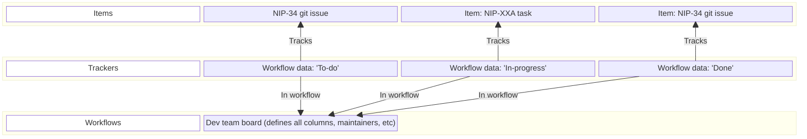
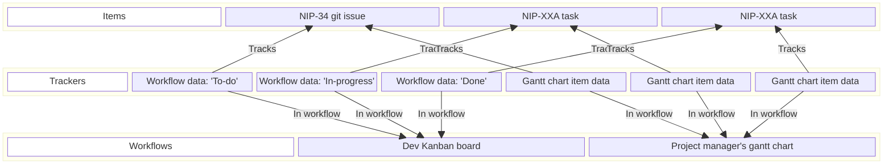
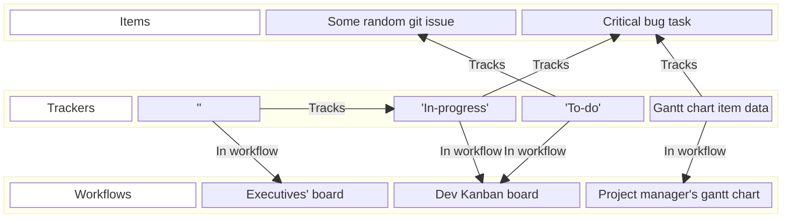

NIP-XXE
=======

Workflows
---------

`draft` `optional`

This NIP defines a base scheme for productive workflows — in a way that is highly extensible, reusable, composable, and interoperable among several use-cases.

### Motivation

Needs and requirements for productive workflows vary greatly between different applications, teams, and use cases, which makes interoperability very challenging.

It goes way beyond simple to-do lists. To illustrate this point, here are examples of such use-cases and needs:
- Kanban boards for developer teams
- A dashboard to track workflows between agency businesses and their clients
- Personal task trackers, to-do lists, shopping lists
- Customer relationship management software (CRMs)
- CI/CD pipelines
- Gantt charts for Project management/planning
- Multifaceted projects with several different teams and departments working on the same project from different angles
- Executive boards to track only a portion of work being done in other workflows
- Customer support workflows
- Editorial flows for longform content
- any other kind of use-case where some coordination is needed to help produce value or get things done

Having a common base that allows for interoperability of those varied applications could greatly reduce work wasted on manual data entry, silos, re-inventing the wheel, and the necessity for N-choose-2 integrations between workflows/APIs.

This NIP is meant to bridge and address those two seemingly opposing needs.

### Main concept and definitions

To achieve the goal of maximum interoperability with minimal coupling, we only need to introduce 3 concepts:

1. A **Workflow** is a system by which people can work together (or alone) towards some goal. It enables communication and coordination towards productive work.
2. A **Tracked Item** (or **Item**) is any item that needs to be tracked within a productive workflow (e.g. A task to be done, a git issue, a customer message to reply to, a part to be manufactured, etc).
3. A **Tracker** is the glue that specifies exactly 3 things:
  1. what Item is being tracked
  2. in which workflow is it being tracked at
  3. any other metadata attached to the **Item** that is relevant to the **Workflow** (e.g. a status on a Kanban board, "dependencies" on a Gantt chart, etc)

The way it works is that **Workflows** track **Items** using **Trackers**. This is a simple pattern, but several workflows can be implemented and composed with it.

It is not a new concept. It is equivalent to the concept of "junction tables" in a database, which is widely used and proven pattern to implement flexible many-to-many relationships without introducing hard interdependencies. Furthermore, this avoids spec rigidity and race conditions at the same time.

### Workflows

**Workflows** are defined in separate NIPs (we will call them **Workflow NIPs** in this document).

Clients and Relays are free to implement whichever Workflow NIP specifications are needed for their use-case.

### Tracked Items

A tracked item can be any _regular_ OR _addressable_ Nostr event — even other **Trackers** (more on this later). Clients MAY use whichever event types that best suits their use-case (e.g. [NIP-34 git issues](34.md), `kind:1` events, etc). [NIP-XXA](XXA.md) is provided as a general-purpose "task" type.


### Trackers

Trackers are a `kind:35000` _addressable event_ with the following structure:

```jsonc
{
  "kind": 35000,
  "content": "<WORKFLOW_SPECIFIC_DATA>",
  "tags": [
    ["d", "<unique addressable event identifier>"]
    ["a", "<kind integer>:<32-bytes lowercase hex of the original author pubkey>:<d tag value>", "<relay-url>", "tracked_item"], // Or ["e", "<ID>", "tracked_item"]
    ["a", "<kind integer>:<32-bytes lowercase hex of the original author pubkey>:<d tag value>", "<relay-url>", "workflow"]
    // ... <WORKFLOW_SPECIFIC_DATA>
  ],
  "pubkey": "...",
  "id": "..."
  "created_at": 1675642635,
  "sig": "...",
}
```

Clients MUST:
- define exactly one `"tracked_item"` tag.
- define exactly one `"workflow"` tag.
- interpret remaining content and tags according to the **Workflow NIP** of the event kind marked as `"workflow"`. In other words, those remaining tags/content are _RESERVED_.

Clients MAY:
- ignore **Trackers** pointing to workflows that they do not understand

Any **Workflow NIP** MUST:
- describe and specify an _addressable_ event kind as defined in [NIP-01](01.md), to model/describe the workflow.
- describe and specify the meaning and usage of the reserved fields, marked as `<WORKFLOW_SPECIFIC_DATA>`. They SHOULD use that to describe how the **Item** fits in the workflow (e.g. The state of the item, start/end date, or any other information)

Any **Workflow NIP** SHOULD:
- Use content and tag information from both the **Tracked Item** as well as the **Tracker**, and make it composable (e.g. Use the tracker data to either complement or replace data/tags from the original item, but use item data when tracker data is not available).
  - The reason for this is to make the system composable, by allowing tracking of other trackers, which significantly expands possible use-cases.

### Editability and multi-user collaboration

This NIP follows the same standards and recommendations for multi-user collaboration as [NIP-XXA](XXA.md).

----
This is the end of the spec. What follows is recommended OPTIONAL reading.

----

# Use-case implementation guide

This section will illustrate the spec in practice, and how it can be used and scaled nicely into ever-more-complex workflows.

## Case 1: Simple kanban development workflow

### Description

A simple kanban to track development work, in a team of developers who have roughly equal authority.

### General structure



Notice how:
- NIP-XXA does not even need to know about kanban boards to exist
- NIP-34 git issues can be seamlessly integrated

### Access controls

Notice how, without much effort, several different access policies can be elegantly applied:
  - Different authority schemes can be applied at any layer:
    - Signing access to the Workflow event allows one to change the structure of the board (coluns, maintainers, etc)
    - Signing access to any of the trackers allows one to change the status of such tasks, and other metadata
    - Signing access to any of the task items allows one to change the description of the task itself, the title, etc.
  - Each one of these Nostr events can be signed by any key, depending on the teams needs.
    - A 1-of-N FROST key can be used if any member can edit things
    - A 2-of-N FROST key can be used if something is more sensitive
    - An authoritative key can be used when only one person/entity should control things
        - Others can still try to edit via edit requests ([XXD.md]), which may be approved.

## Case 2: Client/Service provider dashboards

### Description

A system provided by a service provider to some client (e.g. An agency/freelancer workflow, a package delivery system provided by a company, a ride-share system provided by one driver)

### General structure

(Very similar to Case 1)

### Access controls

The company could sign all of these Nostr events, and allow the client to edit _some_ information in _some_ cases (e.g. They can cancel only before a task is started), via a script that runs on a server, listening to [NIP-XXD](XXD.md) requests, and approving/rejecting based on arbitrary business logic.


## Case 3: Gantt chart for project managers

### Description

The development team grows, and a project management team is hired to do some planning. They like to use Gantt charts to plan things.

### General structure



Notice how:
- Gantt charts, a new workflow type, can be seamlessly integrated without changing the kanban board NIP.

### Access controls

The same principles as Case 1 applies here, with even more options:
- The project management team can have their own team keys, or edit request interfaces, to fine tune exactly who can do what.
- On the kanban side the dev team can have more control and autonomy, whereas on the gantt chart the project management team can have more control and autonomy.


## Case 4: Executive boards

### Description

The product team in Case 3 grows, and the executive team would like to track only a subset of the dev team tasks (e.g. critical bugs).

### General structure



Notice how:
- one tracker tracks another tracker.
- the tracker for the executive board has an empty content. This is on purpose. The kanban workflow spec can be written so that an empty tracker content falls back to the content of what it tracks — which means the executive board will see the actual development state of the original task.

### Access controls

Same principles as all other cases. Very customizable, without breaking interoperability.

----

As demonstrated, this way of building workflows allows for scale and modularity, without compromising interoperability, and without introducing race conditions seen in large lists.
