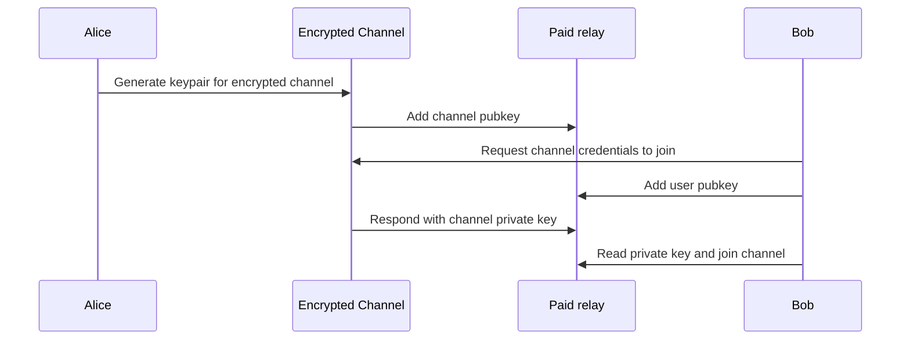

# NIP-XXX

## Joinstr: A protocol for coinjoin using nostr 

This NIP describes the nostr events used in joinstr for collaborative transactions to improve privacy on-chain.

## How does it work?

1. **Create a pool**: Alice can create a pool using basic encrypted channels with `kind:XXXX` event. Event contents have the below information about the pool:

```json
  {
    "type": "new_pool",
    "id": "psfpcilmig1710701402",
    "public_key": "f6f40f620c3db0dc5d11ff67a4cad5b6a7316c57c48cdf40583f54bbbc2d7b49",
    "denomination": 0.01,
    "peers": 10,
    "timeout": 1710702002,
    "relay": "wss://myrelay.local",
    "private_key": "ff0d49343aa8277b38ab4b1c2aa1ae17b599913ca0f938bfcf9aa2a5f30eb9d6"
  }
```

2. **View other pools and join**: Bob reads all `kind:XXXX` events and publishes a NIP 4 event with pool's pubkey being the recipient to join the pool. Pool responds with credentials and further communication happens in channel by publishing NIP 4 events with pool's pubkey as author and recipient.

## Details

- All events are published with a new pubkey
- Encrypted channel communication uses NIP 4 events sent to self
- All peers in a pool use the same IP address using Riseup VPN



Consider Alice and Bob are 2 peers trying to coinjoin using joinstr:

```

- Alice creates a pool with denomination 0.01 BTC and 2 peers
- She publishes her address in the pool
- Listens for incoming pool messages and respond with crdentials
- Post input signed with SIGHASH_ALL | SIGHASH_ANYONECANPY when other peer joins the pool and publishes address

```

```

- Bob request pool credenatials
- Listens for incoming messages for his pubkey used to publish last event
- Join the pool and publish his address for output
- Post input signed with SIGHASH_ALL | SIGHASH_ANYONECANPY

```

A transaction is created with the signed inputs, outputs and broadcasted to complete the coinjoin.

## New Event Kinds

This NIP introduces one new event kinds which is used for creating the pool.


```json
{
    "kind": XXXX,
    "created_at": <unix timestamp in seconds>,
    "pubkey": <new pubkey>,
    "content": pool information as JSON,
    "tags": [],
    "sig": <signed with a new nostr pubkey> 
}
```

### Implementation

https://gitlab.com/1440000bytes/joinstr/-/merge_requests/2

## Known trade-offs & future improvements

- Riseup VPN is used instead of Tor
- NIP 4 events will be replaced with better NIP in next version to improve privacy
- Electrum plugin is still WIP

## Resources

Docs: https://docs.joinstr.xyz  
Sybil resistance: https://delvingbitcoin.org/t/anonymous-usage-tokens-from-curve-trees-or-autct/862/2
