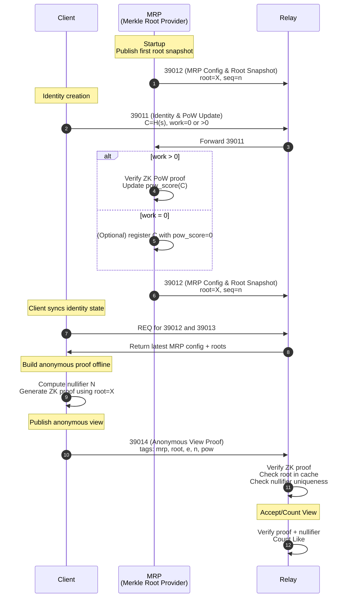

# NIP-Y: Anonymous, PoW-Weighted Actions

Title: Anonymous, PoW-Weighted Actions

Author: Stelios Rammos

Status: Draft

Type: Standard

Created: 2025-12-06

License: MIT

Depends: NIP-X


## 1. Summary

This NIP defines anonymous, Sybil-resistant, verifiable actions (like views, likes, etc.) for Nostr notes.
Users maintain anonymous identity commitments, accumulate PoW trust scores, and publish zero-knowledge proofs that assert:

- Membership in an MRP-maintained identity tree

- A PoW score meeting relay/client thresholds

- Uniqueness via cryptographic nullifiers

- Proofs reveal no identity or linkable metadata.

## 2. Motivation

Native Nostr likes (kind 7) reveal identity and create full reaction graphs.
Views (for analytics) are either not available or entirely local.

This NIP allows:

- Private, unlinkable interactions

- Strong Sybil resistance via PoW

- Relay-verified uniqueness of actions

- PoW-weighted engagement metrics

- Compatibility with existing Nostr infrastructure

## 3. Identity Layer

Defined in NIP-X:

```
C = H(s)
Leaf = { C, pow_score }
```

Users never reveal `C` or `s`.

## 4. Nullifiers

To ensure unique actions:

```
N_view = H(s, "view", event_id)
N_like = H(s, "like", event_id)
```

Nullifiers:

- enforce uniqueness

- do not reveal identity

- cannot be linked across events

## 5. Event Kinds

Purpose	Kind:
- Anonymous View Proof	`39014`
- Anonymous Like Proof	`39015`

## 6. Proof Event Specifications

### 6.1 Anonymous View Proof — Kind 39014

Tags:

```
["mrp", "<provider_id>"]
["root", "<hex_root_used>"]
["e", "<event_id>"]
["n", "<hex_N_view>"]
["pow", "<min_pow_required>"]
["type", "view"]
```

**Content:** Base64-encoded ZK proof.

Relay behavior (optional):

- Verify ZK proof

- Confirm trusted MRP

- Confirm root is in cache

- Reject duplicate nullifiers

- Count view

### 6.2 Anonymous Like Proof — Kind 39015

Tags:

```
["mrp", "<provider_id>"]
["root", "<hex_root_used>"]
["e", "<event_id>"]
["n", "<hex_N_like>"]
["pow", "<min_pow_required>"]
["type", "like"]
```

**Content:** Base64-encoded ZK proof.

Relay behavior (optional):

- Verify ZK proof
- Enforce nullifier uniqueness
- Count like

## 7. ZK Circuit Requirements

**Public Inputs**
```
event_id
membership_root
action_type
pow_threshold
nullifier_out
```

**Private Inputs**
```
s
C = H(s)
pow_score
merkle_path
```

**Constraints**

- `C = H(s)`

- Leaf `(C, pow_score)` is included in `membership_root`

- `pow_score ≥ pow_threshold`

- `nullifier_out = H(s, action_type, event_id)`

## 8. Client Workflow
### 8.1 Fetch MRP State

Clients subscribe to:

- MRP configuration (`39012`)

- MRP root snapshots (`39013`)

### 8.2 Generate Proof (Offline)

1. Select MRP + valid root

2. Compute nullifier

3. Generate ZK proof offline

### 8.3 Publish Proof Event

Send `39014` or `39015` with:

```
["mrp", "<provider_id>"]
["root", "<hex_root_used>"]
["e", "<event_id>"]
["n", "<nullifier>"]
["pow", "<threshold>"]
```

## 9. Relay Workflow

Relays COULD:

- Confirm the referenced MRP is trusted

- Check the root is stored in its root-history window

- Verify the ZK proof

- Enforce nullifier uniqueness

MRPs are not contacted during verification.

## 10. Security Considerations

- Nullifiers must be checked per (event_id, action_type).

- PoW thresholds determine spam resistance.

- Cached roots must be authentic MRP snapshots.

## 11. Privacy Considerations

- Proofs are unlinkable across events

- Nullifiers leak nothing about identity

- PoW updates reveal no user behavior

## 12. Rationale

This NIP separates:

- Identity state management (NIP-X)

- Anonymous interaction proofs (this NIP)

- allowing relays and clients to adopt different MRPs while keeping proofs local, verifiable, and privacy-preserving.

## 13. Backwards Compatibility

This NIP introduces new event kinds. It does not modify or conflict with existing Nostr semantics.

## 14.  Proof Size and Event Weight

Anonymous view/like proofs can use succinct SNARKs (e.g., Groth16), keeping events small.

Typical proof size: ~200–250 bytes

Base64 content size: ~300–400 bytes

Total event size (including tags): ~600–800 bytes

The circuit is minimal (hash checks, Merkle inclusion, PoW comparison), so proof size does not grow with tree size. Events remain lightweight, efficient to gossip, and suitable for mobile clients.

## 15. Diagram



## 16. License

MIT
